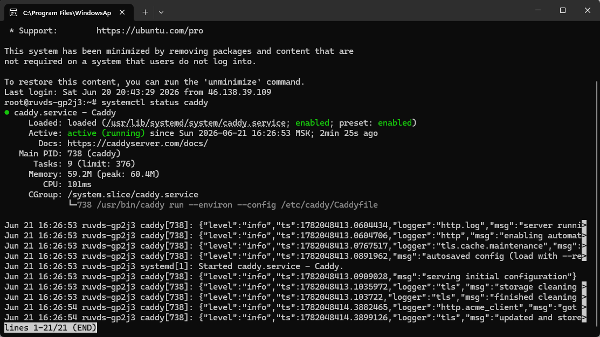
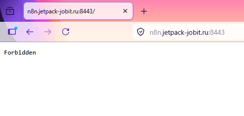
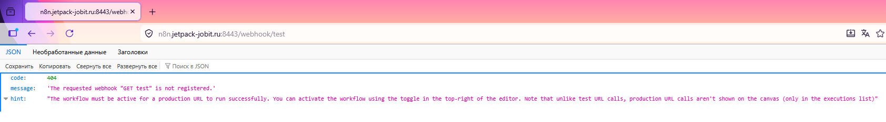
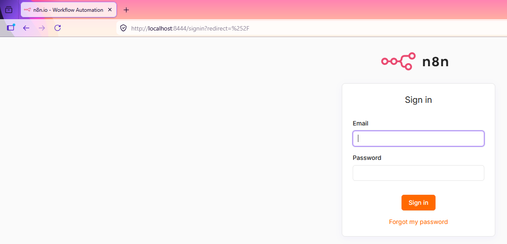

# 1. Caddy и файрвол на VPS

## Оглавление

- [Исходные данные](#11-исходные-данные)
- [DNS-запись](#12-dns-запись)
- [Файрвол](#13-файрвол-iptables)
- [Установка Caddy](#14-установка-caddy)
- [Конфигурация Caddy](#15-конфигурация-caddy)
- [Проверка Сертификата](#16-проверка-сертификата)
- [Закрытие порта 80](#17-закрываем-порт-80)
- [Результат](#18-результат)

## 1.1. Исходные данные

- VPS с Ubuntu 24.04
- Публичный IP-адрес (в проекте: `194.87.74.111`)
- Доменное имя (в проекте: `jetpack-jobit.ru`, поддомен `n8n.jetpack-jobit.ru`)
- n8n развёрнут на виртуалке `192.168.122.5` (в проекте: `10.30.0.2:5678`, доступен через WireGuard-туннель)

> [!NOTE]
> Вместо собственного домена можно использовать бесплатный DuckDNS.
> Caddy автоматически получит сертификат в обоих случаях.

> [!TIP]
> IP `10.30.0.2` — адрес виртуалки внутри WireGuard-туннеля.
> Если ваш n8n доступен по локальной сети, замените на его реальный IP.

> [!IMPORTANT]
> Порт `8443` используется вместо стандартного `443`, потому что `443`
> уже занят AmneziaWG (UDP). Если ваш сервер не использует AmneziaWG
> на `443`, можете заменить `8443` на `443` в конфигурации Caddy
> и файрволе — это упростит URL вебхуков.

## 1.2. DNS-запись

В панели управления доменом создайте A-запись:

- **Имя:** `n8n`
- **Тип:** A
- **Значение:** публичный IP VPS (например: `194.87.74.111`)
- **TTL:** 600

Проверка:

```bash
nslookup n8n.jetpack-jobit.ru
```

## 1.3. Файрвол (iptables)

В проекте используется iptables-persistent. Политика по умолчанию — DROP.
Открываем нужные порты:

```bash
# Loopback
sudo iptables -A INPUT -i lo -j ACCEPT

# SSH
sudo iptables -A INPUT -p tcp --dport 22 -j ACCEPT

# HTTP (для получения сертификата Let's Encrypt)
sudo iptables -A INPUT -p tcp --dport 80 -j ACCEPT

# HTTPS (вебхуки)
sudo iptables -A INPUT -p tcp --dport 8443 -j ACCEPT

# Админка (только для своего IP или WireGuard)
sudo iptables -A INPUT -p tcp -s 10.30.0.0/24 --dport 8444 -j ACCEPT

# Разрешаем установленные соединения
sudo iptables -A INPUT -m state --state ESTABLISHED,RELATED -j ACCEPT

# Запрещаем всё остальное
sudo iptables -A INPUT -j DROP
```

Сохраняем:

```bash
sudo netfilter-persistent save
```

## 1.4. Установка Caddy

```bash
sudo apt install -y debian-keyring debian-archive-keyring apt-transport-https
curl -1sLf 'https://dl.cloudsmith.io/public/caddy/stable/gpg.key' | sudo gpg --dearmor -o /usr/share/keyrings/caddy-stable-archive-keyring.gpg

echo "deb [signed-by=/usr/share/keyrings/caddy-stable-archive-keyring.gpg] https://dl.cloudsmith.io/public/caddy/stable/deb/debian any-version main" | sudo tee /etc/apt/sources.list.d/caddy-stable.list

sudo apt update && sudo apt install caddy -y
```

## 1.5. Конфигурация Caddy

Файл /etc/caddy/Caddyfile:

```text
{
    email your@email.ru
}

n8n.jetpack-jobit.ru:8443 {
    handle /webhook/* {
        reverse_proxy 10.30.0.2:5678
    }
    respond "Forbidden" 403
}

n8n.jetpack-jobit.ru:8444 {
    reverse_proxy 10.30.0.2:5678
}
```

**Что здесь происходит:**

- :8443 — публичный порт для вебхуков. Только путь /webhook/* проксируется на n8n, всё остальное получает 403 Forbidden
- :8444 — порт для админки n8n. Доступ ограничен файрволом (см. 1.3)
- Caddy автоматически получает SSL-сертификат Let's Encrypt для указанного домена

**Перезагружаем:**

```bash
sudo systemctl restart caddy
```

**Проверяем:**

```bash
sudo systemctl status caddy
```



## 1.6. Проверка сертификата

Через 30-60 секунд после запуска сертификат будет получен:

```bash
sudo journalctl -u caddy --no-pager | grep "certificate obtained"
```

Должен вернуть: certificate obtained successfully.

> [!TIP]
> Если поддомен был создан недавно, DNS-запись может ещё не успеть
> распространиться. Caddy повторит попытку получения сертификата
> автоматически. Однако если запросы на сертификат выполнялись до
> того, как DNS обновился, Let's Encrypt может временно (на час)
> заблокировать повторные попытки — это сработал лимит на количество
> неудачных проверок. Дождитесь окончания блокировки и перезапустите
> Caddy: `sudo systemctl restart caddy`.

## 1.7. Закрываем порт 80

После получения сертификата порт `80` больше не нужен для Caddy.
Если в вашем проекте этот порт не используется, закройте его:

```bash
sudo iptables -D INPUT -p tcp --dport 80 -j ACCEPT
sudo netfilter-persistent save
```

> [!NOTE]
> Если на этом же VPS работают другие сервисы, требующие HTTP (например,
> сайт или редиректы), оставьте порт открытым. На работу Caddy это не влияет.

## 1.8. Результат

- `https://n8n.jetpack-jobit.ru:8443/` — `Forbidden` (защита от посторонних)
- `https://n8n.jetpack-jobit.ru:8443/webhook/test` — запросы уходят на n8n
- `https://n8n.jetpack-jobit.ru:8444/` — админка (только с разрешённых IP)
- Зелёный замочек в браузере, сертификат обновляется автоматически.




Я захожу через localhost в силу установленных ограничений. Вы можете настроить свои правила доступа.
