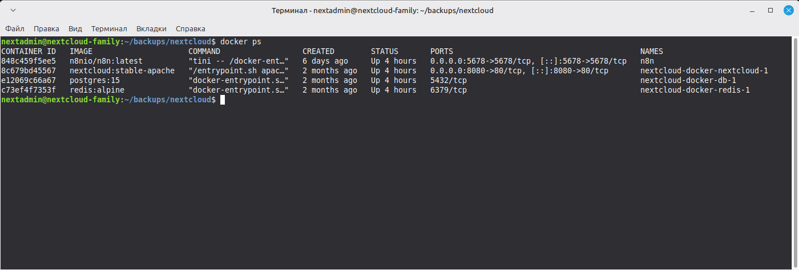
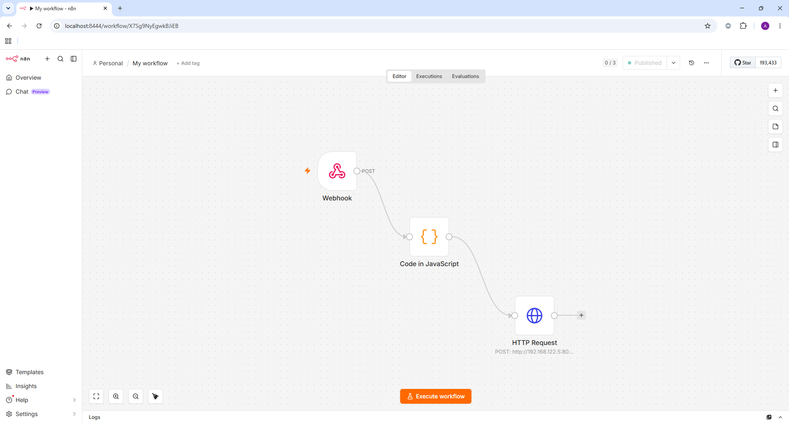

# 2. n8n: установка и доступ

## Оглавление

- [Исходные данные](#21-исходные-данные)
- [Docker Compose](#22-docker-compose)
- [Первый вход и создание учетной записи](#23-первый-вход-и-создание-учётной-записи)
- [Доступ к админке](#24-доступ-к-админке-ssh-туннель)

## 2.1. Исходные данные

- n8n разворачивается на той же машине, что и Nextcloud (виртуалка `192.168.122.5`)
- Docker и Docker Compose уже установлены
- n8n будет слушать порт `5678` и принимать вебхуки от Caddy

## 2.2. Docker Compose

Перед запуском создайте папку для данных и установите права.
Пользователь `node` внутри контейнера имеет UID 1000:

```bash
mkdir -p ~/n8n/n8n_data ~/n8n/local_files
chown -R 1000:1000 ~/n8n/n8n_data ~/n8n/local_files
```

> [!WARNING]
> Без этого шага n8n завершится с ошибкой EACCES: permission denied
> при попытке записать конфигурацию.

```yaml
services:
  n8n:
    image: n8nio/n8n:latest
    container_name: n8n
    restart: always
    ports:
      - "5678:5678"
    environment:
      - N8N_BASIC_AUTH_ACTIVE=true
      - N8N_BASIC_AUTH_USER=admin
      - N8N_BASIC_AUTH_PASSWORD=ваш_пароль
      - N8N_HOST=n8n.jetpack-jobit.ru
      - N8N_PORT=5678
      - N8N_PROTOCOL=https
      - WEBHOOK_URL=https://n8n.jetpack-jobit.ru:8443
      - NODE_ENV=production
    volumes:
      - ./n8n_data:/home/node/.n8n
      - ./local_files:/files
```

Замените `ваш_пароль` на надёжный пароль для входа в `n8n`.

Запуск:

```bash
docker compose up -d
docker compose logs -f
```

Дождитесь `n8n ready on ::, port 5678`, затем `Ctrl+C`.



## 2.3. Первый вход и создание учётной записи

При первом запуске n8n предложит создать владельца. Заполните email, имя и пароль.


Так будет выглядеть workflow, но он будет пустым. Созданием и соединением нод займемся далее. Не забывайте опубликовать (`Published` в правом верхнем углу) workflow, чтобы он начал принимать запросы.

## 2.4. Доступ к админке (SSH-туннель)

> [!IMPORTANT]
> В данной конфигурации n8n развёрнут в изолированной сети за CGNAT.
> Прямой доступ к интерфейсу n8n невозможен, поэтому используется SSH-туннель.
> Если ваш n8n доступен по локальной сети, используйте http://YOUR_IP:5678.

На рабочей машине создайте файл `n8n-tunnel.ps1` **(Windows)** или `n8n-tunnel.sh` **(Linux)**:

**Windows (PowerShell):**

```powershell
ssh -L 8444:192.168.122.5:5678 mintadmin@10.10.10.254
```

**Linux:**

```bash
ssh -L 8444:192.168.122.5:5678 mintadmin@10.10.10.254
```

**Замените адреса на свои.**
  
После запуска откройте в браузере `http://localhost:8444` и войдите в n8n.
