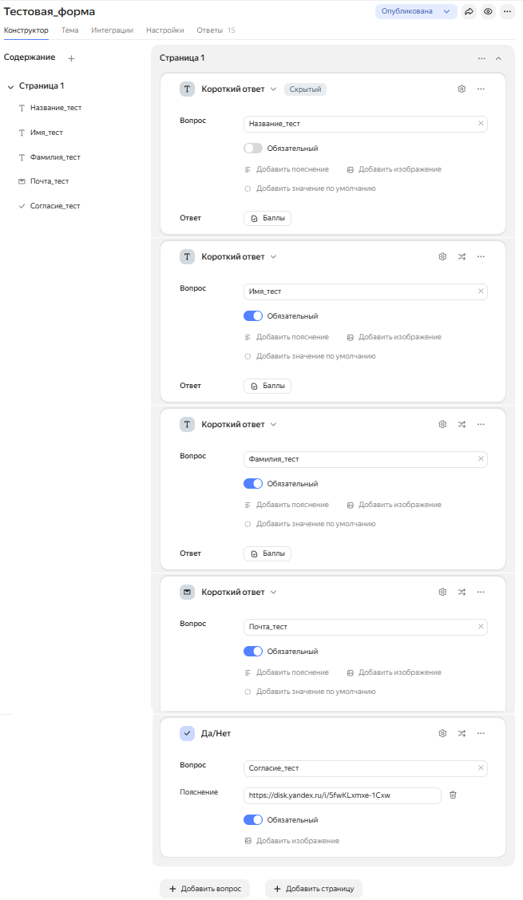
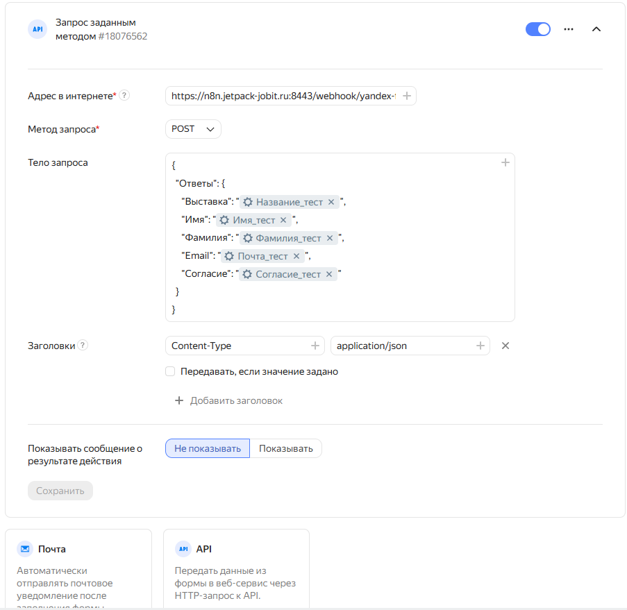
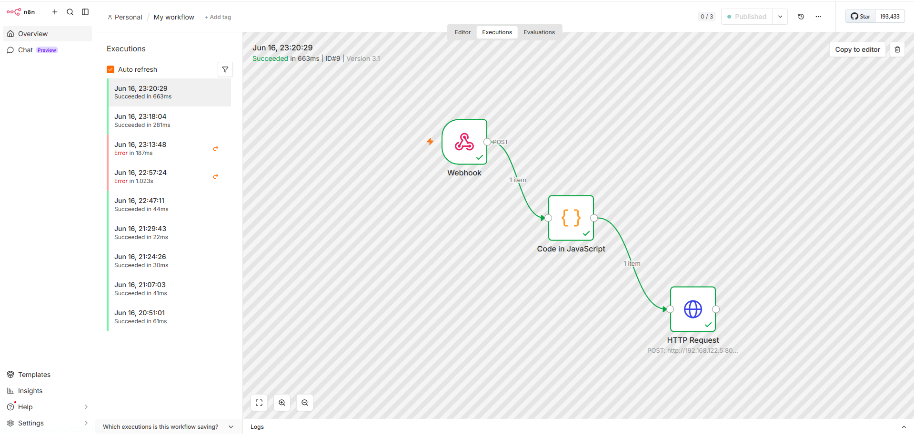

# 3. Яндекс.Форма и интеграция

- [Создание формы](#31-создание-формы)
- [Скрытое поле](#32-скрытое-поле)
- [Настройка интеграции](#33-настройка-интеграции)
- [Создание Workflow в n8n](#34-создание-workflow-в-n8n)
- [Тестирование](#35-тестирование)

## 3.1. Создание формы

> [!IMPORTANT]
> Форма используется одна для всех мероприятий. Название мероприятия
> передаётся через скрытое поле `expo`, которое подставляется из параметра
> URL (`?expo=Название`). Участник сканирует QR-код с уже подставленным
> названием — даже если заполнит форму спустя неделю, в таблицу попадёт
> правильное мероприятие. Это решает проблему «забывчивых».

Создайте форму в [Яндекс.Формах](https://forms.yandex.ru/) со следующими полями:

- **Скрытое поле** с идентификатором `expo`
- **Имя** — текстовое поле
- **Фамилия** — текстовое поле
- **Email** — поле email
- **Согласие на обработку данных** — галочка (обязательное)

## 3.2. Скрытое поле

Скрытое поле `expo` заполняется через параметр URL. При копировании публичной ссылки на форму добавьте в конец:

```text
?expo=Название_Мероприятия

Пример:
https://forms.yandex.ru/.../view/?expo=Выставка2026
```

Затем превратите ссылку в QR-код и используйте на мероприятии.

### Моя тестовая форма



## 3.3. Настройка интеграции

В конструкторе формы:

1. Перейдите в  **Интеграции**
2. Снизу выберите **API** → **Запрос заданным методом**
3. Настройте:
   - **Адрес в интернете:** `https://n8n.jetpack-jobit.ru:8443/webhook/yandex-form`
   - **Метод:** POST
   - **Тело запроса:** сюда нужно вписать, в каком виде будет передаваться заполненная форма. Пример ниже.
   - **Заголовки:** Первая строка: `Content-Type`, вторая строка: `application/json`

**Пример тела запроса:**

```json
{
  "Ответы": {
    "Выставка": "{{Скрытое поле expo}}",
    "Имя": "{{Имя}}",
    "Фамилия": "{{Фамилия}}",
    "Email": "{{Email}}",
    "Согласие": "{{Согласие}}"
  }
}
```

> [!IMPORTANT]
> {{...}} - это **переменные**, которые вы выбираете из выпадающего списка ответов на вопросы, а не пишете вручную. Чтобы подставить свои переменные, нужно в поле `Тело запроса` нажать на **+** в правом верхнем углу и выбрать `Ответ на вопрос`, вставив его в кавычки.

4. Сохраните интеграцию.



## 3.4. Создание Workflow в n8n

Создайте Workflow из трёх нод:

**Webhook:**

- Method: POST
- Path: yandex-form
- Переключите Workflow в Active

**JavaScript (Code):**

```javascript
const body = $input.first().json.body.Ответы;

return {
  expo: body.Выставка || '',
  first_name: body.Имя || '',
  last_name: body.Фамилия || '',
  email: body.Email || '',
  consent: body.Согласие === 'Да' ? true : false,
  submitted_at: new Date().toISOString()
};
```

**HTTP Request** — будет настроен в следующей главе.

## 3.5. Тестирование

Заполните форму тестовыми данными. В n8n, в разделе Executions, проверьте, что данные пришли и JavaScript отработал.


