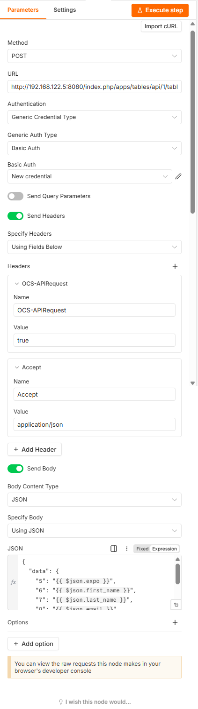
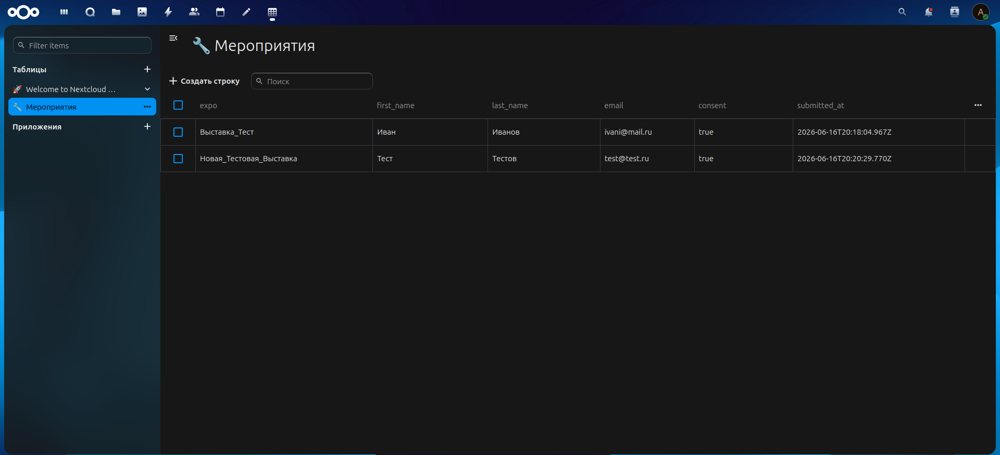

# 4. Вывод данных в Nextcloud Tables

- [Установка Tables](#41-установка-tables)
- [Создание таблицы](#42-создание-таблицы)
- [Токен API](#43-токен-api)
- [ID таблицы и столбцов](#44-id-таблицы-и-столбцов)
- [HTTP Request в n8n](#45-http-request-в-n8n)
- [Тестирование](#46-тестирование)
- [Резервное копирование](#47-резервное-копирование)

## 4.1. Установка Tables

В Nextcloud: Аватар → Приложения → Офис и текст → найти **Tables** → Установить и включить.

## 4.2. Создание таблицы

Создайте таблицу (например, «Мероприятия») со столбцами:

- `expo` (текст)
- `first_name` (текст)
- `last_name` (текст)
- `email` (текст)
- `consent` (текст)
- `submitted_at` (текст или дата/время)

## 4.3. Токен API

Аватар → Личные настройки → Безопасность → **Активные устройства и сеансы**.

- Название приложения: **n8n**
- Создать пароль приложения: **Nextcloud сгенерирует пароль**

> [!WARNING]
> **Пароль показывается один раз! Скопируйте его сразу.**

## 4.4. ID таблицы и столбцов

ID таблицы виден в адресной строке при открытии:

```text
/apps/tables/#/table/2
```

ID столбцов можно получить через API:

```bash
curl -X GET "http://192.168.122.5:8080/index.php/apps/tables/api/1/tables/2/columns" \
  -u "admin:ВАШ_ТОКЕН" \
  -H "Accept: application/json"
```

В ответе найдите свои столбцы и запишите их `id` — они понадобятся в следующем шаге.

Пример:

```text
{"id":5,"tableId":2,"title":"expo","createdBy":"admin","createdByDisplayName":"admin","createdAt":"2026-06-16
{"id":6,"tableId":2,"title":"first_name","createdBy":"admin","createdByDisplayName":"admin","createdAt":"2026-06-16 
{"id":7,"tableId":2,"title":"last_name","createdBy":"admin","createdByDisplayName":"admin","createdAt":"2026-06-16 
```

|ID столбца|Название|
|----------|--------|
|5|expo|
|6|first_name|
|7|last_name|
|8|email|
|9|consent|
|10|submitted_at|

> [!IMPORTANT]
> В данном проекте n8n обращается к Nextcloud по локальному IP 192.168.122.5.
Если ваш Nextcloud доступен в интернете, замените URL на публичный и используйте HTTPS.

## 4.5. HTTP Request в n8n

Настройте третью ноду в Workflow:

|Параметр|Значение|
|--------|--------|
|Method|POST|
|URL|`http://192.168.122.5:8080/index.php/apps/tables/api/1/tables/2/rows`|
|Authentication|Basic Auth|
|Username|ваш_логин_nextcloud|
|Password|токен_приложения|

**Headers:**

- OCS-APIRequest: true
- Accept: application/json
- Content-Type: application/json

**Body (JSON):**

```json
{
  "data": {
    "5": "{{ $json.expo }}",
    "6": "{{ $json.first_name }}",
    "7": "{{ $json.last_name }}",
    "8": "{{ $json.email }}",
    "9": "{{ $json.consent }}",
    "10": "{{ $json.submitted_at }}"
  }
}
```



## 4.6. Тестирование

Заполните форму и проверьте таблицу в Nextcloud. Должна появиться новая строка.

Проверка через `curl`:

```bash
curl -X POST "http://192.168.122.5:8080/index.php/apps/tables/api/1/tables/2/rows" \
  -u "admin:ВАШ_ТОКЕН" \
  -H "Accept: application/json" \
  -H "Content-Type: application/json" \
  -d '{"data":{"5":"Тест","6":"Иван","7":"Петров","8":"test@test.ru","9":"Да","10":"2026-06-16T20:00:00Z"}}'
```



## 4.7. Резервное копирование

Скрипты в `backup/` создают ежедневные копии n8n и Nextcloud. Хранится 7 последних копий, старые удаляются автоматически. Подробности — в комментариях внутри скриптов.

[Скрипты тут](../backup/). Размещаются на ВМ, где крутится n8n и Nextcloud.

### Установка

```bash
chmod +x backup-n8n.sh backup-nextcloud.sh
mkdir -p /home/nextadmin/backups/n8n /home/nextadmin/backups/nextcloud
sudo crontab -e
# Вставить содержимое backup-cron.txt
```
