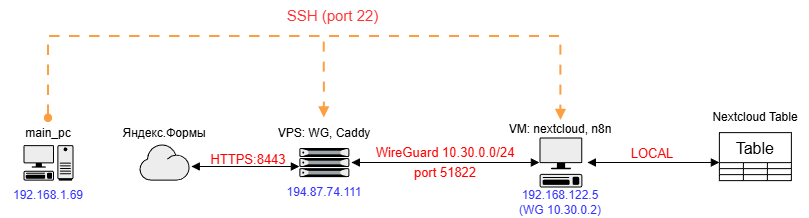

# 5. Заключение

## 5.1. Что получилось

Автоматизирован сбор данных с мероприятий:

- Участник сканирует QR-код → заполняет Яндекс.Форму → данные попадают в Nextcloud Tables
- Коллега избавилась от ручного переноса бумажных анкет в Excel
- Исключены ошибки ручного ввода
- Решена проблема «забывчивых» участников (название мероприятия фиксируется в момент сканирования QR-кода)

## 5.2. Ключевые технологии

| Компонент | Роль |
| --------- | ---- |
| Яндекс.Формы | Сбор данных, вебхук через API |
| Caddy | Reverse proxy, автоматический SSL |
| WireGuard | Туннель VPS ↔ домашний сервер |
| n8n | Обработка и маршрутизация данных |
| Nextcloud Tables | Хранение и отображение данных |
| iptables | Файрвол с политикой DROP по умолчанию |

## 5.3. Схема сети

## 5.4. Адаптация под другие окружения

> [!NOTE]
> Проект реализован на домашней инфраструктуре с двойным NAT и CGNAT.
> При переносе в продакшен с публичным сервером архитектура упрощается:
> Яндекс.Формы → n8n (публичный) → Nextcloud (публичный), без VPS-прокладки
> и WireGuard-туннеля. Практики безопасности (iptables, reverse proxy,
> автовыпуск сертификатов) применимы в любой среде.

## 5.5. Ссылки

- Репозиторий проекта: [yandex-forms-to-nextcloud](https://github.com/jetpackfm/yandex-forms-to-nextcloud)
- Сборка сервера: [mpd-server](https://github.com/jetpackfm/mpd-server)
- Nextcloud + VPN: [nextcloud-family-vpn](https://github.com/jetpackfm/nextcloud-family-vpn)

## 5.6. Конфиги

- [Caddyfile](../caddy/)
- [Backups](../backup/)
- [iptables rules](../iptables/)
- [n8n yaml](../n8n/)
